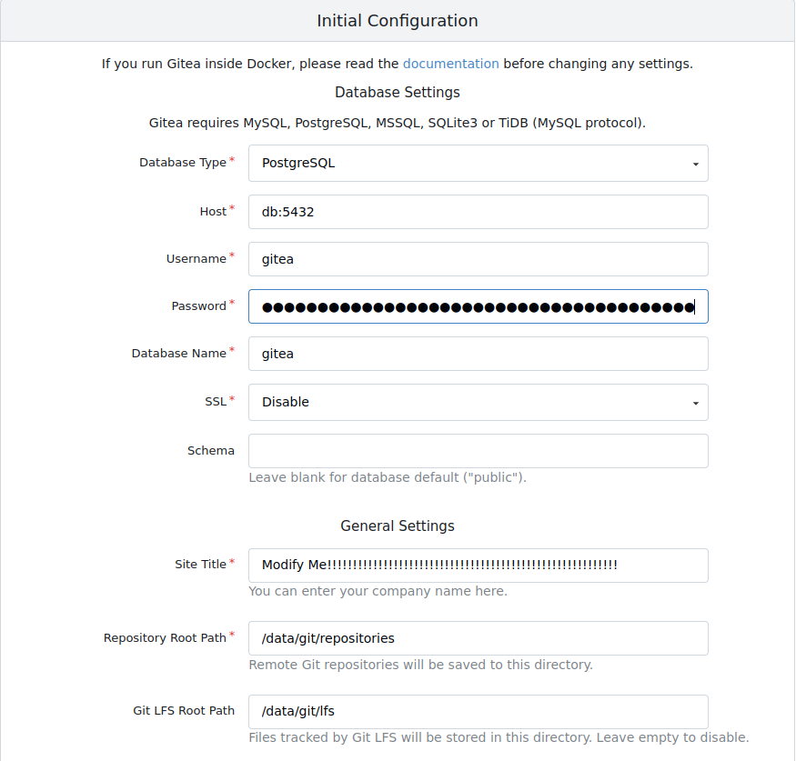
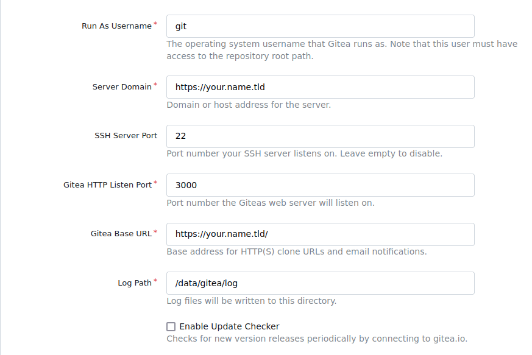
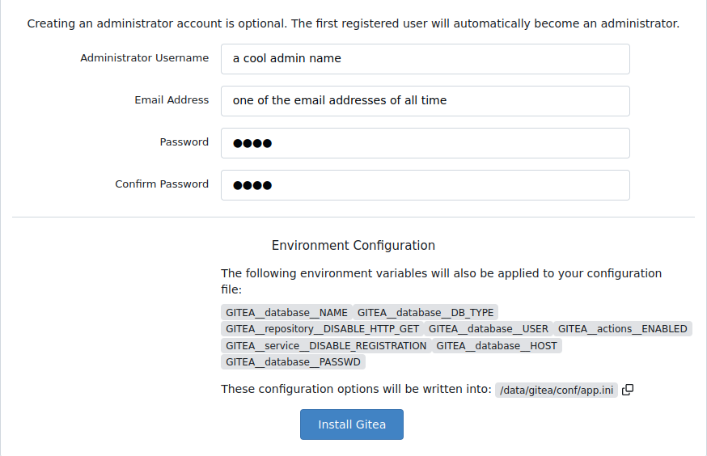

# Introduction

Hello reader from the 4th dimension: the internet. This post covers how I used Nginx, Gitea, and Docker together
to create the Git instance hosted at [git.evotrade.org](https://git.evotrade.org). I am new to Nix (I started 2 days ago),
so I hope this blog sheds some light covering the 3??? posts I found on duckduckgo covering Gitea and Nix.

## This is not a replacement for official documentation!

If you need a true understanding of anything deeper than what's in this post, please for love of god visit
gitea's official website!

[https://docs.gitea.com/next/installation/install-with-docker](https://docs.gitea.com/next/installation/install-with-docker)

# The wonderful compose file

Here's the compose file for those who hate scrolling down and don't want to read (me included 👍)

**Actually modify this!** Note: 辛抱 means patience in Japanese (google translate ftw)

```compose.yml
networks:
  gitea:
    external: false

volumes:
  gitea_vol:
    driver: local

services:
  server:
    image: gitea/gitea:latest
    container_name: gitea
    environment:
      - USER_UID=994 # This is a note
      - USER_GID=992 # This is also a note
      - GITEA__database__DB_TYPE=postgres
      - GITEA__database__HOST=db:5432
      - GITEA__database__NAME=gitea
      - GITEA__database__USER=gitea
      - GITEA__database__PASSWD=modify_me_with_辛抱
      - GITEA__service__DISABLE_REGISTRATION=true
      - GITEA__repository__DISABLE_HTTP_GET=true
      - GITEA__actions__ENABLED=true
    networks:
      - gitea
    volumes:
      - gitea_vol:/data
      - /var/lib/gitea-server/.ssh:/data/git/.ssh
      - /etc/timezone:/etc/timezone:ro
      - /etc/localtime:/etc/localtime:ro
    ports:
      - "3000:3000"
      - "127.0.0.1:2222:22"
    restart: unless-stopped
    depends_on:
      - db

  db:
    image: docker.io/library/postgres:14
    restart: always
    environment:
      - POSTGRES_USER=gitea
      - POSTGRES_PASSWORD=modify_me_with_辛抱
      - POSTGRES_DB=gitea
    networks:
      - gitea
    volumes:
      - ./postgres_data:/var/lib/postgresql/data  
```

After pasting this into a file, you should absolutely modify the password used.

Final note: **Don't put plaintext passwords straight in the file in prod.**
There are ways around this with docker secrets, but it's a pain and not in the Nix style.
I have my config setup like this until I learn enough Nix to turn this into its own .nix file.

Another Final Note: Take a gander at the UID and GID, you will probably need to modify
those for your own setup. Details later.

### Modifications I made to this compose.yml

```compose-snippet.yml
services:
  server:
    environment:
      - GITEA__service__DISABLE_REGISTRATION=true
      - GITEA__repository__DISABLE_HTTP_GET=true
      - GITEA__actions__ENABLED=true
```

disable registration just makes it so new people can't go to my repo, make an account, and then wreak unspeakable things on my server.
disable http get just makes cloning over http impossible. No sneaky in my code :).
actions enabled allows repo wide actions to happen. Google what they are, trust.

### How to run

In order to run this, I'm assuming you have decent knowledge about docker. If not,
you have google. No link for you.

Basically all you need to do to run this is:

`sudo docker compose up -d` once you've **changed** the password. If you have an email address,
feel like interacting, and need help, my email can be found in the [About](https://git.evotrade.org/about) section.

This will open a web server at `your_local_ip_here:3000`. If 3000 is taken, modify the `3000:3000` to be something like `3001:3000`.
This sets the exposed port to your host do be `3001` rather than `3000`.

Afterwards some basic configuration will pop up. **You actually have to edit some of these**





congartulation! You have successfully completed the easist part of this post.

# NixOS configuration :))))))))))))))))

```configuration-snippet.nix
{
  users.users.git = {
    isSystemUser = true;
    group = "git";
    home = "/var/lib/gitea-server";
    createHome = true;
    shell = "/var/lib/gitea-server/ssh-shell";
  };

  users.groups.git = {};

  # For nginx to work with acme
  # https://bkiran.com/blog/using-nginx-in-nixos
  users.users.nginx.extraGroups = [ "acme" ];

  # Enable the OpenSSH daemon.
  services.openssh = {
    enable = true;
    ports = [ 22 ];
    settings = {
      PasswordAuthentication = false;
      AllowUsers = null;
      UseDns = true;
      X11Forwarding = true;
      PermitRootLogin = "no";
    };
  };

  # Open ports in the firewall.
  networking.firewall.allowedTCPPorts = [ 22 80 443 ];
  networking.firewall.allowedUDPPorts = [ 22 80 443 ];

  # Pulled directly from the wiki
  # https://nixos.wiki/wiki/Nginx
  services.nginx = {
    enable = true;

    recommendedGzipSettings = true;
    recommendedOptimisation = true;
    recommendedProxySettings = true;
    recommendedTlsSettings = true;

    sslCiphers = "AES256+EECDH:AES256+EDH:!aNULL";

    appendHttpConfig = ''
      # Add HSTS header with preloading to HTTPS requests.
      # Adding this header to HTTP requests is discouraged
      map $scheme $hsts_header {
          https   "max-age=31536000; includeSubdomains; preload";
      }
      add_header Strict-Transport-Security $hsts_header;

      # Enable CSP for your services.
      #add_header Content-Security-Policy "script-src 'self'; object-src 'none'; base-uri 'none';" always;

      # Minimize information leaked to other domains
      add_header 'Referrer-Policy' 'origin-when-cross-origin';

      # Disable embedding as a frame
      add_header X-Frame-Options DENY;

      # Prevent injection of code in other mime types (XSS Attacks)
      add_header X-Content-Type-Options nosniff;

      # This might create errors
      proxy_cookie_path / "/; secure; HttpOnly; SameSite=strict";
    '';

    # The definitions of the individual sites go here.
    virtualHosts."name.tld" = {
      serverName = "name.tld";
      useACMEHost = "name.tld";
      acmeRoot = "/var/lib/acme/challenges-name";
      forceSSL = true;
      locations."/" = {
        proxyPass = "http://127.0.0.1:3009"; # this is just a proxy to my static site
      };
    };

    virtualHosts."git.name.tld" = {
      serverName = "git.name.tld";
      useACMEHost = "name.tld";
      acmeRoot = "/var/lib/acme/challenges-name";
      addSSL = true;
      forceSSL = false;
      locations."/" = {
        proxyPass = "http://127.0.0.1:3000"; # the gitea docker container
      };
    };

    virtualHosts.default = {
      serverName = "_";
      default = true;
      rejectSSL = true;
      locations."/".return = "444";
    };
  };

  # SSL cert renewal
  security.acme = {
    acceptTerms = true;
    defaults.email = "one_of_the_email_addresses@email.tld";
    certs."name.tld" = {
      webroot = "/var/lib/acme/challenges-name";
      email = "one_of_the_email_addresses@email.tld";
      group = "nginx";
      extraDomainNames = [
        "git.name.tld"
      ];
    };
  };

  virtualisation.docker.enable = true;
}
```

Creates and starts Nginx, will automatically renew certs for you too which is pretty cool.
Points Nginx to redirect to the Docker container.

I'm gonna assume you know how to structure a Nix configuration.

If you want to see all of my configurations, they can be found on [github](https://github.com/RowanTL/nix-configuration/blob/911262a991e0c4c638670404d6906776a036ac07/hosts/roebox/configuration.nix).
This configuration is under `hosts/roebox/configuration.nix`.

# Setting up SSH

At this point you should have all of the mandatory steps above completed. You need that git user basically.

In this example, I have my git user's home directory at `/var/lib/gitea-server`. Now it's a matter of following the official instructions
with a very slight amount of deviation. 

[https://docs.gitea.com/next/installation/install-with-docker](https://docs.gitea.com/next/installation/install-with-docker)

1) Get your git user's UID and GID.

Use `sudo -u git id`. Copy and paste the respective values into the compose file above.
This replaces the
```compose-snippet.yml
      - USER_UID=994 # This is a note
      - USER_GID=992 # This is also a note
```

2) Generate an ssh key for your boy

`sudo -u git ssh-keygen -t ecdsa -b 521 -C "Gitea Host Key"`. You can place key pair anywhere, I put it in `/var/lib/gitea-server/.ssh`.

3) Copy and paste the generated public key into the authorized_keys file

I'm not giving commands for this one. The authorized_keys file `/var/lib/gitea-server/.ssh/authorized_keys`

4) `sudo -u git chmod 600 /var/lib/gitea-server/.ssh/authorized_keys`

5) Ensure everything is owned by the git user

`sudo chmod -R git:git /var/lib/gitea-server/.ssh`

6) Make ssh-shell

I didn't try very hard with sshing shim because of the pathing.
Instead I did sshing shell.

```ssh-shell-creation.sh
cat <<"EOF" | sudo tee /var/lib/gitea-server/ssh-shell
#!/bin/sh
shift
ssh -p 2222 -o StrictHostKeyChecking=no git@127.0.0.1 "SSH_ORIGINAL_COMMAND=\"$SSH_ORIGINAL_COMMAND\" $@"
EOF
sudo chmod +x /var/lib/gitea-server/ssh-shell
```

I would make a test repo and see if cloning this works with ssh after adding a new public key to your account.
Never add the generated public key from step 2 to gitea.

# Outro

This was a culmination of a days effort attempting to figure this out. Hope this helps someone.
Email me if you need help.
